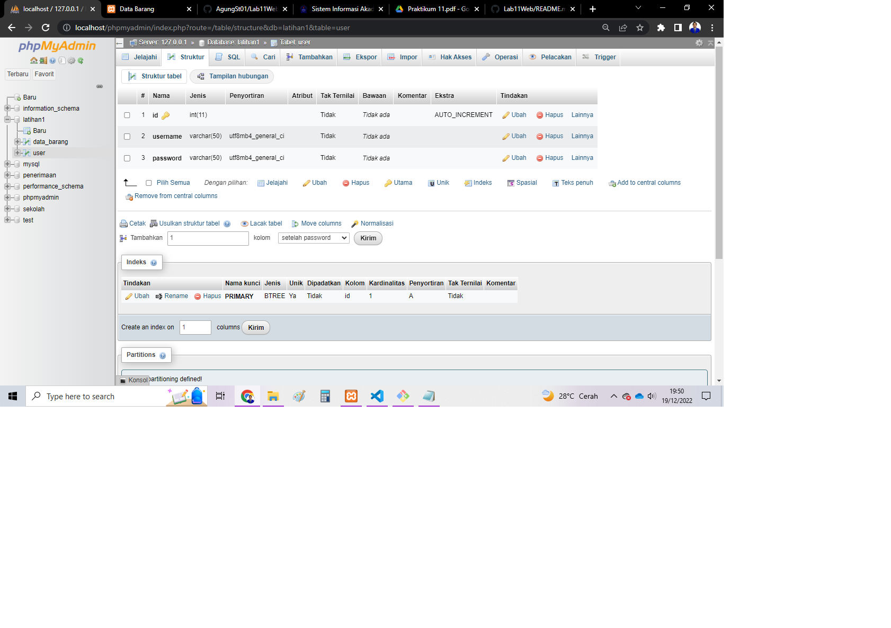

# Lab11
## STUDI KASUS LOGIN FORM
### BUAT DATABASE BARU
Buatlah table database baru dengan nama user pada database latihan1

Dan jangan lupa untuk buat password dengan setting md5

Dan berikut hasilnya

### MEMBUAT FILE login_session.php
Buat lah file login_session.php. File ini digunakan untuk pengecekan sesi login, file ini nantinya akan di include di setiap halaman yang membutuhkan login.

Dan berikut hasilnya

### MEMEMBUAT FILE login.php
Buatlah file login.php. Dengan kode sebagai berikut
image.png

Dan berikut hasilnya

### Hasil nya apabila memasukan user yang salah

### Hasil nya apabila memasukan user yang benar akan masuk ke menu index.php

